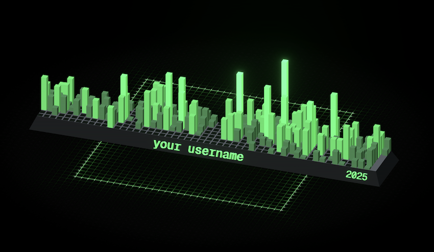

# contributions
visualize your github contributions graph in 3D!   
   

# Cool Features
- Fully customizable.   
- Export to STL ascii or binary for 3D printing.   
- Embed anywhere.   

# Customizations
### theme
theme to be used throughout the app.   
can be any hex color, minus the `#`.   
for example: `https://g3c.vercel.app?username=tool3&theme=ccff00`

### menu
show or hide menu.   
can be `true` or `false`.   
for example: `https://g3c.vercel.app?username=tool3&menu=false`

### font
font to use for text.   
can be `geistmono`, `grotesque`, `inter`, `monaspace`.   
for example: `https://g3c.vercel.app?username=tool3&font=grotesque`

### material
material to use for bars and text.   
can be `standard` or `matcap`.   
for example: `https://g3c.vercel.app?username=tool3&material=matcap`

### matcap
matcap to be used for bars and text.   
only applied if `material` is set to `matcap`.   
use `matcap_` prefix and any number between 0 and 60.   
for example: `https://g3c.vercel.app?username=tool3&material=matcap&matcap=matcap_33`

# Got a suggestion?
Open an issue! I'd love to hear your feedback!   